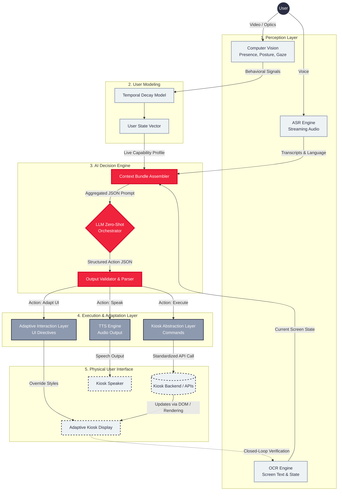
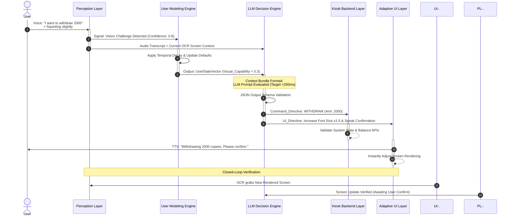
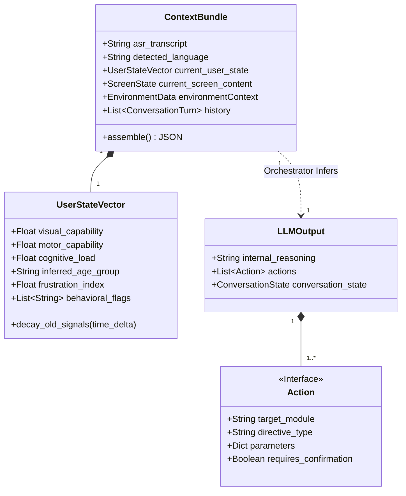
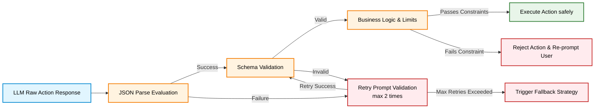

# UIAA Architectural Diagrams

This document contains professional-grade Mermaid diagrams designed for inclusion in the UIAA Technical White Paper or any accompanying documentation. They can be natively embedded into Markdown files or rendered into images for LaTeX using Mermaid tools.

## 1. High-Level System Architecture
This flowchart maps the 6-layer pipeline, highlighting the clear separation between Perception, AI Decision (Orchestration), and Execution.

## 2. Real-Time Execution Sequence Diagram
This sequence diagram demonstrates the low-latency closed-loop interaction over time.

## 3. Data Entities & Context Bundle Model
A class diagram showing the exact data shapes feeding into the LLM and coming out of it. 

## 4. Safety Validation & Multi-Tier Fallback Pipeline
This flowchart illustrates the robustness of the system architecture in case of anomalies.

